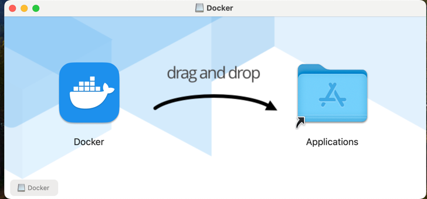
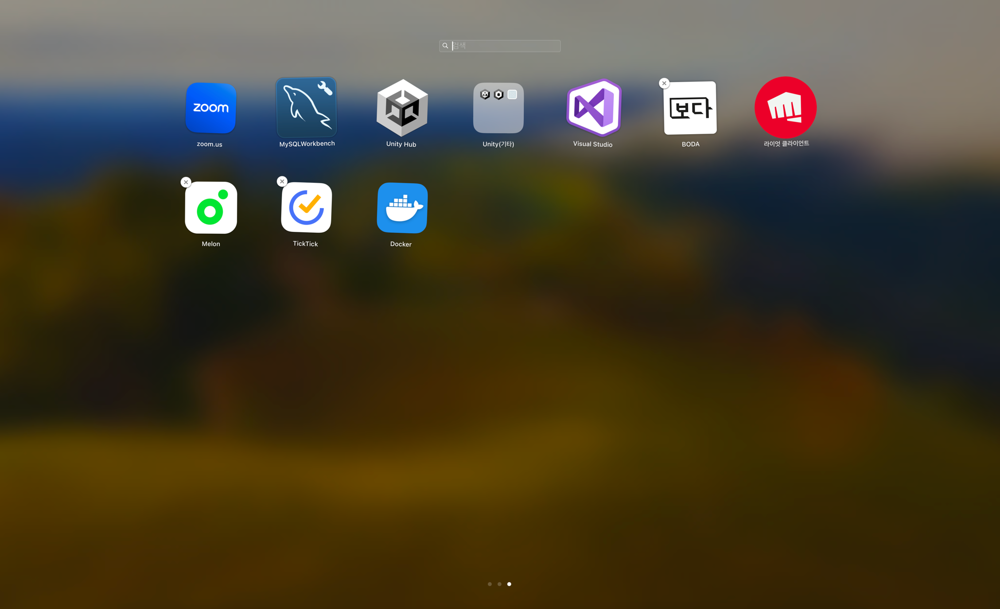

# 도커 설치하는 방법

- 오늘은 제 맥북에 도커를 설치해보려고 해요. 도커를 설치하기 위해서는 먼저 도커 웹사이트에 접속해야 해요

https://www.docker.com/products/docker-desktop/

위 웹사이트로 접속하면 아래 화면처럼 나와요

위 페이지에서 다운로드 버튼을 누르면 도커 설치 파일이 다운로드 됩니다!

저는 맥북이라 따로 설치 과정이 없고 그냥 도커 애플리케이션을 애플리케이션 폴더로 옮겨주면 된답니다!

짜잔 그럼 설치가 이렇게 된거를 볼 수 있어요

이것으로 오늘 도커를 설치해 보았어요. 다음에는 도커를 기본적으로 사용하는 방법을 알아볼게요!
